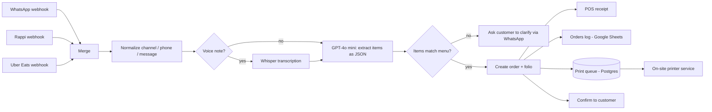

# Case study: Multi-channel order automation for a restaurant

> Client details are anonymized. No names, phone numbers, IDs or credentials appear in this repository.

**Client profile:** Independent restaurant in Mexico taking orders by WhatsApp and delivery platforms.
**Role:** Consultant. Discovery, workflow design, implementation, documentation.
**Status:** In rollout

## Problem

Orders arrived through several channels (WhatsApp messages and voice notes, Rappi, Uber Eats). Staff re-typed each one into the POS, which was slow at peak hours and error-prone, and the kitchen depended on someone shouting or forwarding screenshots.

## Solution

One n8n workflow receives every channel, normalizes it into a single order format, uses an LLM to turn free text or transcribed voice notes into structured items, validates them against the menu, and fans out to the POS, a log sheet, the customer and the kitchen.

The print queue is consumed by the [kitchen ticket printer](../projects/kitchen-ticket-printer) in this repo.

## Key design decisions

| Decision | Why |
|---|---|
| Single workflow with a Merge node instead of one per channel | One place to fix bugs and change the menu logic |
| LLM at low temperature, strict JSON output, `valido` flag | Deterministic parsing; unknown dishes trigger a clarification instead of a wrong order |
| Menu match against the POS catalog in code, not by the LLM | The LLM only extracts; the source of truth for what exists stays the POS |
| Postgres queue between n8n and the printer | Printer being offline never blocks or loses an order |
| Heartbeat monitoring on every critical component | Failures must alert us before the customer notices |

## Problems solved along the way

- **Inconsistent payload shapes across channels**: a normalization node with fallbacks (`body.source || body.channel`, `body.from || body.customer_phone`), plus handling for a double-nested `body.body` case.
- **WhatsApp Cloud API error `133010`** (account not registered): traced to the phone number's connection state in Meta Business Manager, not to the app or token. Documenting the diagnostic order (number state, then WABA/phone-number IDs, then token) saved hours on the second occurrence.
- **OAuth for Google Sheets on a hosted n8n**: the redirect URI must be registered in Google Cloud Console to match the n8n instance's public URL.

## Stack

n8n (self-hosted on Railway) · WhatsApp Cloud API (Meta) · OpenAI Whisper + GPT-4o mini · Loyverse API · Google Sheets · PostgreSQL · Python · ESC/POS thermal printing

## What I'd do next

- Add an error-handling workflow that posts failures to a chat channel
- Replace polling with a push mechanism where network conditions allow
- Add a daily summary report of orders by channel
